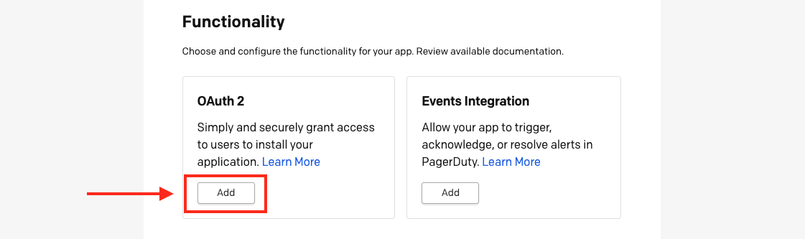

#### What is OAuth 2.0 functionality?
OAuth 2 allows your app to connect to our <Link to="/api-reference/">REST API</Link> as a PagerDuty user (not full account access) to administer PagerDuty or get data (create an on-call schedule, get a list of team members, etc).

#### Why should I use OAuth 2.0?
With OAuth 2.0, you can present a user with a prompt to log in with their PagerDuty account and authorize your app to access their PagerDuty data.

This is a simple and seamless process for the user and more secure because as an app developer you can:
* Limit your access to read-only
* Scope your access to the permissions of a specific user
* Allow PagerDuty users to monitor and revoke access to your app at any time
* Eliminate copying and pasting API tokens which could lead to the token falling into the wrong hands

#### Add OAuth 2.0 functionality to your app
1. <Link to="/docs/app-integration-development/register-an-app/">Create an app in PagerDuty</Link>
2. In the **Functionality** section, click **Add** on the OAuth 2.0 card.

3. On the next page, enter a **Redirect URL**. PagerDuty will only redirect users to a URL saved to your OAuth configuration. Click **Save**. You can edit or add redirect URLs later.

3. Under **Tokens**, the app’s **Client ID** and **Client Secret** are displayed. The Client ID is public and will be used to identify the app when it authenticates with PagerDuty. The Client Secret should be stored securely and must not be shared publicly - PKCE does not require the use of client_secret. If the Client Secret has been compromised, select **Regenerate** to create a new Client Secret.
4. Under **Set Permission Scopes**, select an option from the drop-down. By default, the app does not have any permissions set. There are two scope options: **Read** or **Read/Write**. These scopes are tied to the user’s permissions. Authenticated users will only be able to read and write to objects that they have access to.
5. It is recommended to **Add a message to users** to let them know what data the app will access and how the app will utilize that data.

Congratulations! OAuth 2.0 is successfully configured for the app. Now you can move on to implementing one of the authorization flows below.

#### Implementing OAuth / Choosing An OAuth Flow

There two options for implementing PagerDuty OAuth in your app. <Link to="/docs/app-integration-development/oauth-2-pkce/">PKCE (Proof Key for Code Exchange)</Link> is recommended and should work for all apps. The <Link to="/docs/app-integration-development/oauth-2-auth-code-grant/">Authorization Code Grant</Link> Flow is also supported.

| Choose A Flow For Your App:   |      Server-side App*      |  Client-side App** |
|:---------------------------------------------------------------------------------------|:-----|:----|
| <Link to="/docs/app-integration-development/oauth-2-pkce/">PKCE - Proof Key for Code Exchange</Link> **(Recommended)** |  Yes | Yes |
| <Link to="/docs/app-integration-development/oauth-2-auth-code-grant/">Authorization Code Grant</Link> |  Yes | No  |

**Client-side App* - an app which runs in the browser or a native mobile app

**Server-side App* - an app running on a server which can securely store secrets

#### Removing OAuth 2.0 Functionality
See <Link to="/docs/app-integration-development/app-functionality/#removing-functionality-from-your-app">Removing Functionality From Your App</Link>
