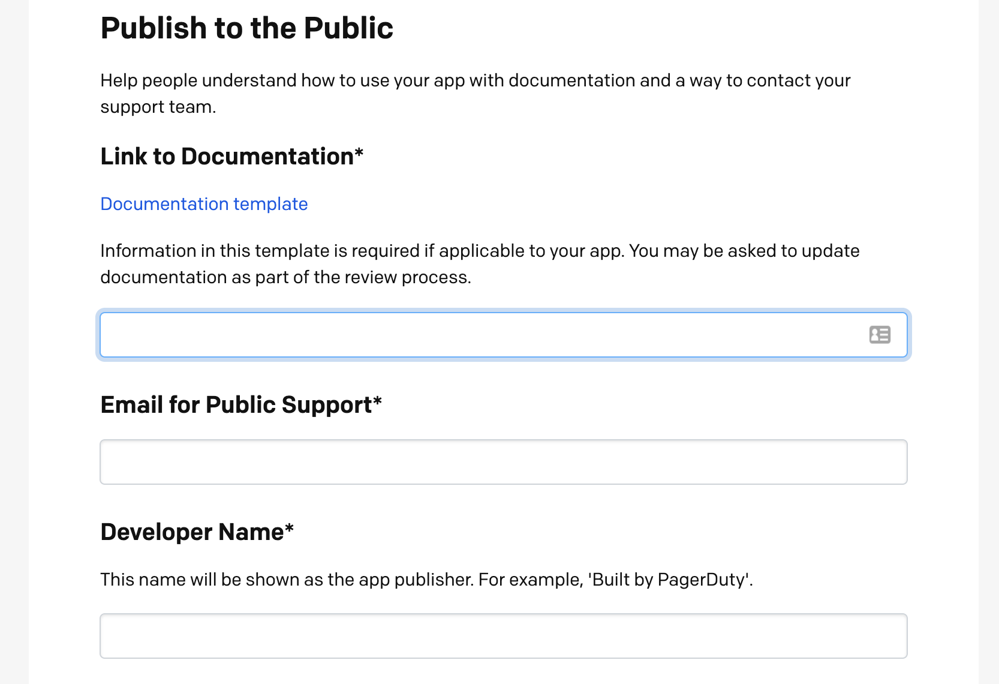

Once you're done building an app, you can publish it! Publishing completely optional.

### Manage Distribution

On your app's configuration page, scroll down to the **Distribution** section and click the **Manage** button.

### Publish To All PagerDuty Users

You can optionally publish your app for all PagerDuty users to discover and use. Follow these steps to submit your app for review.

1. On the **Distribution** page (see above), enter information for your app listing (like documentation and support contact) and provide instructions for testing your app.

2. At the bottom of the **Distribution** page under **Submit for Review**, click the **Publish** button and confirm that you would like to submit.

Once you submit, you will not be able to make edits to the app while it is under review. If you need to make changes after you submit, please contact apps@pagerduty.com to get your app back into an editable draft state.

You should receive a confirmation email once your app is submitted for review.

### Review Process

We aim to review your submission and approve or reply with feedback within 5 business days.

**During the review process, we will:**
* Test your app's functionality
* Review documentation for completeness and accuracy (please use this [documentation template](https://github.com/PagerDuty/app-documentation-templates/blob/master/integration-guide-template.md) to avoid change requests during review)
* Ensure all required information is submitted and accurate for your listing (support contact, website links, etc)

If we find issues with your submission or have questions, we will contact you at the email used for your PagerDuty account. The reviewer may ask for additional info or updates to your app or documentation before your submission is approved.

If you have questions about this process or your submission, please email **apps@pagerduty.com**.
