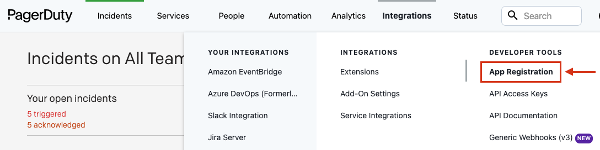
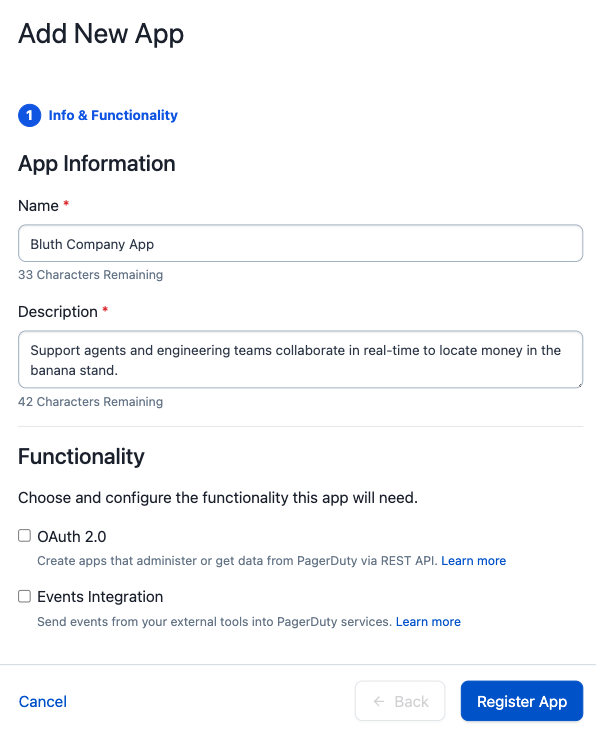

# Register an App

### Accessing App Registration Page

When you log into a developer account, you'll be taken straight to the App Registration page. If you're on a PagerDuty customer account, follow these steps:

**Note:** App Registration is available only to users with a base role of User or Manager (Advanced Permissions) and above.

1. Log in to your PagerDuty account.
2. From the top menu, select **Integrations**.
3. Select **App Registration** from the menu to navigate to the **My Apps** page.

### Creating an app
<!-- theme: info -->
> Apps are associated with a PagerDuty subdomain and a user and cannot be moved between subdomains or users. Continued access to this subdomain and user is needed to make any configuration changes to the app.

On the **My Apps** page, select **Create New App**. Enter a name for your app and a brief description.

After saving to register your new app, you will be directed to the **Configure App** page to add functionality and set configuration. The new app will also now appear under **My Apps** in the **App Registration** page.

### Editing your app configuration

Immediately after registering a new app, or by selecting an app from the **My Apps** page, you will be directed to the **Configure App** page. From this page you can:
- Edit the app name and description.
- [Add API and/or OAuth functionality](../../docs/app-integration-development/04-App-Functionality.md).
- [Distribute/publish your app](../../docs/app-integration-development/11-Publish-Your-App.md) to share with all PagerDuty customers.
- Provide an **App Website URL** where users can learn more about the app.
- Upload an **App Icon**, an image file that will display with the app. Icons should be sized 50px by 50px. Once the image file is uploaded, the image will display to the side and in the **Preview** box.

