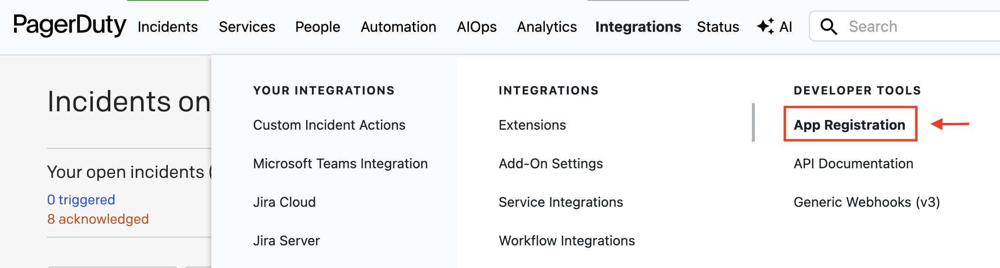
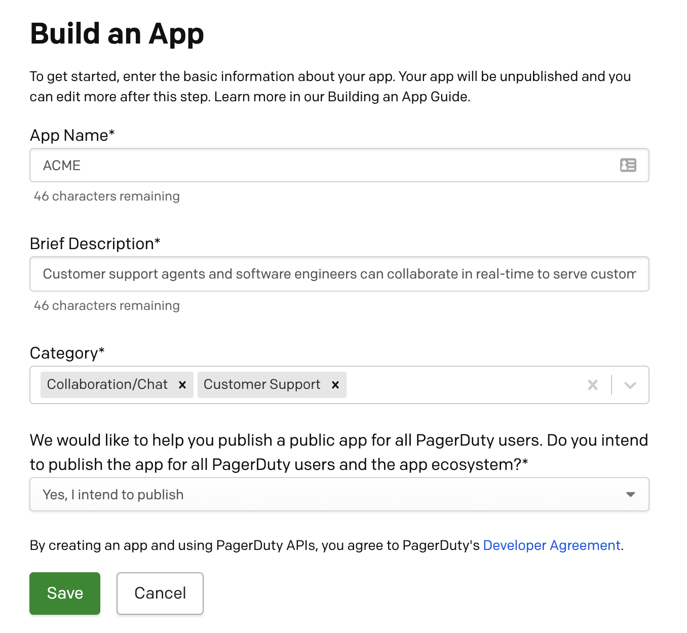
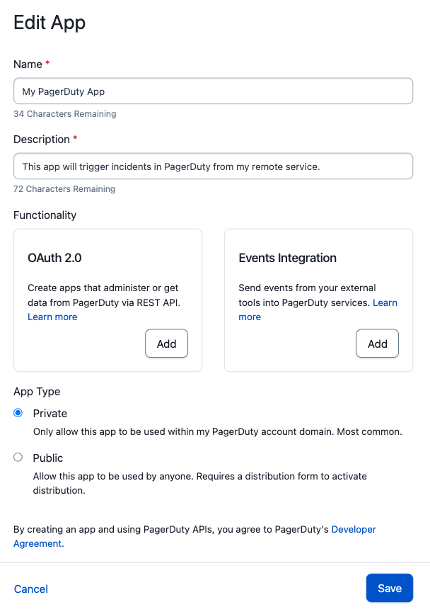
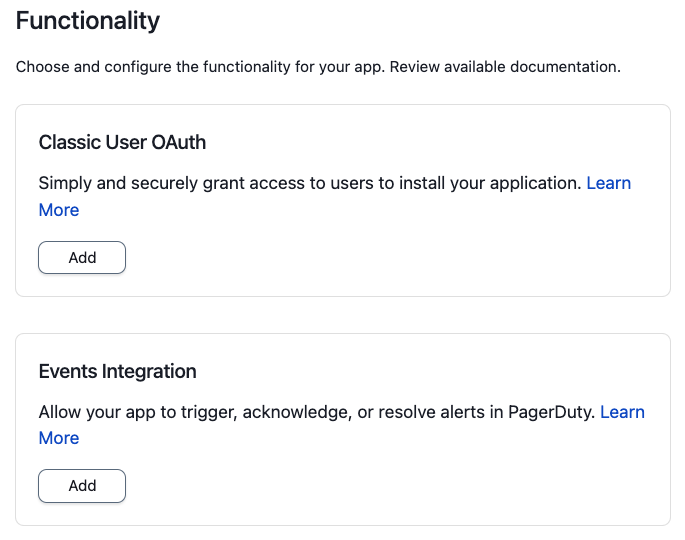
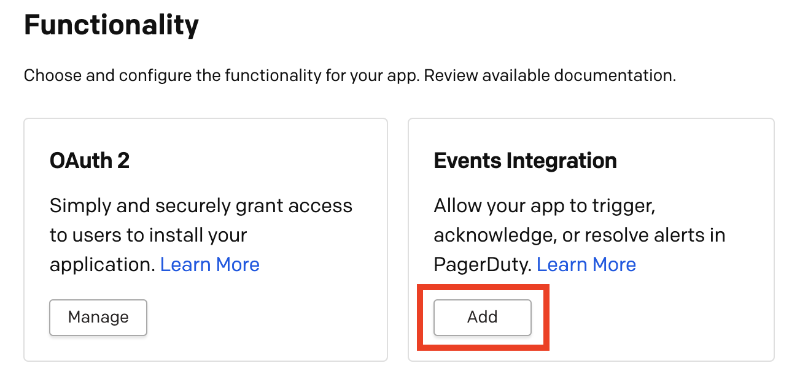
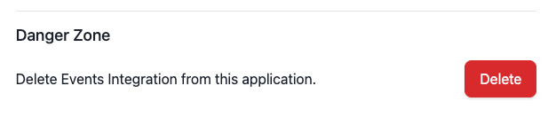
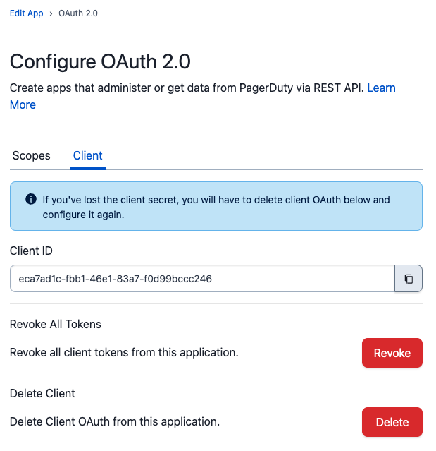
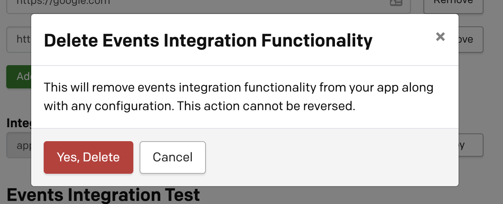

# Register an App

## Accessing App Registration Page

When you log into a developer account, you'll be taken straight to the App Registration page. If you're on a PagerDuty customer account, follow these steps:

**Note:** App Registration is available only to users with a base role of Manager, Global Admin or Account Owner.

1. Log in to your PagerDuty account.
2. From the top menu, select **Integrations**.
3. Select **Developer Tools**, then **App Registration** from the menu to navigate to the **My Apps** page.

## Creating an app
<!-- theme: info -->
> Apps are associated with a PagerDuty subdomain and a user and cannot be moved between subdomains or users. Continued access to this subdomain and user is needed to make any configuration changes to the app.

On the **My Apps** page, select **New App**. Enter a name for your app and a brief description, and complete the rest of the New App wizard as necessary.

The new app will now appear under **My Apps** in the **App Registration** page.

## Editing your app configuration

By selecting an app from the **My Apps** page, you will be directed to the **Edit App** page. From this page you can:
- Edit the app name and description.
- Add API and/or OAuth functionality, as described below.
- [Change your App Type to distribute/publish your app](08-Publish-Your-App.md) and share with all PagerDuty customers.

## Adding functionality to your app

A newly registered app does not do anything on its own. Add functionality to make it useful — see [App Functionality](01-Overview.md#app-functionality) for what is available and which option fits your needs.

1. Go to the configuration page for your app. See [Editing your app configuration](#editing-your-app-configuration) above.
2. Scroll down to the **Functionality** section of the page and click the **Add** button on the card which represents the functionality you would like to add.
3. On the next page, you'll be asked for more information to configure that app functionality.
4. Click **Save** to save the configuration and add that functionality to your app.
5. Click the **Manage** button to make edits or remove functionality from an app.

### Adding Events Integration functionality

In the **Functionality** section, click **Add** next to Events Integration. Then click **Save** on the Events Integration config page.

From there you can set up the [Simple Install Flow](05-Events-Integration.md#simple-install-flow-optional-but-recommended) and [add an Event Transformer](05-Events-Integration.md#add-an-event-transformer).

### Adding OAuth functionality

In the **Functionality** section, click **Add** on the OAuth card, then choose between Classic User OAuth and Scoped OAuth on the **Configure OAuth 2.0** screen. See [OAuth Functionality](06-OAuth-Functionality.md) for the difference between them, and [Private Apps](02-Private-Apps.md) if your app will only be used on your own account.

## Removing functionality from your app

<!-- theme:warning -->
> This action cannot be undone. Be sure that app functionality is not needed before you remove it.

1. Go to your app's configuration page. See [Editing your app configuration](#editing-your-app-configuration) above.
2. Scroll down to the **Functionality** section of the page and click the **Manage** button on the card which represents the functionality you would like to remove.
3. To remove Events Integration Functionality scroll to the **Danger Zone** at the bottom of the page and click **Delete**

To remove OAuth functionality, navigate to the Client tab and click Delete.

4. Confirm that you would like to remove app functionality

<!-- theme:info -->
> Deleting OAuth functionality _does not_ automatically revoke existing tokens. If you wish to perform both operations, you must [revoke all tokens](06-OAuth-Functionality.md#revoking-tokens) _before_ deleting the OAuth functionality.
