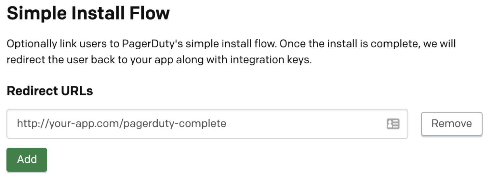
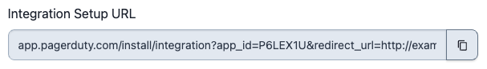
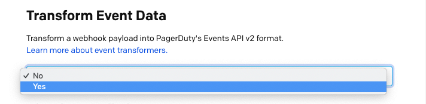
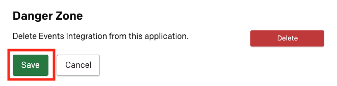
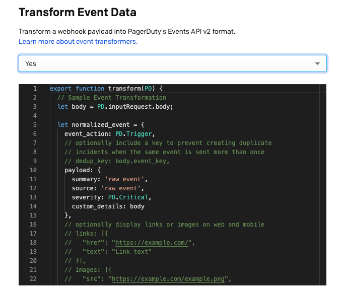
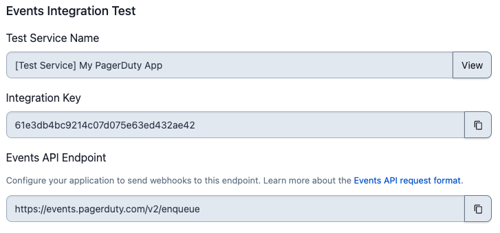

# Events Integration Functionality

## What is Events Integration functionality?
Events Integration allows you to send machine events **from** your tool **to** PagerDuty over our asynchronous [Events API v2](../../docs/events-API-v2/01-Overview.md)

## Why should I use Events Integration?
This is the best way for monitoring tools to connect with PagerDuty in order to trigger incidents. You'll also be able to acknowledge and resolve incidents. Using the Events API means your app will work with PagerDuty's [Event Intelligence](https://www.pagerduty.com/platform/event-intelligence-and-automation/) features like intelligent grouping and triage.

To add this functionality to an app, see [Adding Events Integration functionality](04-Register-an-App.md#adding-events-integration-functionality).

## Simple Install Flow (optional, but recommended)

The Simple Install Flow provides an interface for installing a PagerDuty integration directly from your application. Similar to OAuth!

**Why should I use this flow?**
* Better experience for users. They don't need to copy and paste keys from PagerDuty.
* Less work for you (interface is built and maintained by PagerDuty)

**See it in action here:** [acme.pagerduty.dev](https://acme.pagerduty.dev)

Follow these steps to leverage Simple Install Flow for your app:

1. Add a redirect URL for your application. This is where we will redirect the browser to once the user completes the install flow. If you would like to pass through additional GET parameters or a URL fragment when redirecting back, you should URL-encode the `redirect_uri` parameter in the Integration Setup URL.



2. Implement a page in your app which will receive the request. You should be prepared to handle a request in the format below. Note: you will receive a collection of integration keys and should be prepared to handle more than one.

```http
GET http://<your app URL>?config=<encoded JSON>
```

|||
|-|-|
|`integration_key`|For use the with PagerDuty Events API|
|`name`           |Name of the object the integration key connects to|
|`id`             |Unique ID of the object the integration key connects to|
|`type`           |Type of object (service, global_event_rules, team_rules) Note: others may be added in the future|

**Decoded JSON will follow this format:**

```json
{
  "integration_keys": [
    {
      "integration_key": "key1",
      "name": "Super Cool Service",
      "id": "PD12345",
      "type": "service"
    },
    {
      "integration_key": "key2",
      "name": "Global Event Rules",
      "id": "PD6789A",
      "type": "global_rule_set"
    },
    {
      "integration_key": "key3",
      "name": "B Team's Rules",
      "id": "PDBCDEF",
      "type": "team_rule_set"
    }
  ],
  "account": {
    "subdomain": "dev-acme",
    "Name": "Acme Monitoring"
  }
}
```

3. Once you’ve saved, test out your flow using the **Integration Setup URL** on the page. If you would like to pass through additional GET parameters or a URL fragment, you should URL-encode the `redirect_uri` parameter in the Integration Setup URL.



4. Present this link to users in your application at the right time.

## Add An Event Transformer

**What is an Event Transformer?**

An Event Transformer is an optional part of a PagerDuty app. It contains JavaScript code (ES6) used to convert a payload sent to PagerDuty into the [Events API v2](../../docs/events-API-v2/02-Trigger-Events.md) Common Event Format. Event Transformers are hosted and executed in PagerDuty.

**Why should I use an Event Transformer?**

Use an Event Transformer when a technical service you are connecting to PagerDuty is not capable of modifying its payload before they are sent to PagerDuty. An Event Transformer will allow you to connect it to PagerDuty without hosting an application or serverless function to transform the webhook payload.

### Set up an Event Transformer

1. Under **Transform Event Data** on the Events Integration functionality page, select Yes.



2. Use the editor to modify the template to transform any webhook payload into the Events API v2 format. See [Writing a transformer](#writing-a-transformer) below.

3. After making necessary code changes, click **Save** at the bottom of the page to deploy the transform.



**Note:**
* The pre-populated template creates an event with the raw body of the POST request payload in custom details.
* You must **Save** to redeploy your transformer code.
* After saving, your transform may take several minutes to deploy. **During this time, events will not be processed.**

## Writing a transformer

### Code Editor

The Events Integration functionality page contains a [Monaco](https://github.com/microsoft/monaco-editor) code editor which you can use to author your JavaScript (ES6) transform.


#### Syntax Errors
* The editor will highlight syntax errors for you to address.
* You will not be able to save and deploy a transformer until syntax errors are addressed.

#### Testing Your Transformer
* [Create a test service](#test-your-integration).
* Send test webhooks to the test service endpoint.

### The PD Object

The `PD` object is a utility to help you process and transform an event. Its constants and methods are below.

#### Constants
##### Event types
For convenience, constants are provided for the `event_type` field: `PD.Trigger`, `PD.Acknowledge`, and `PD.Resolve`.

  Name            | Description
----------------- | -----------
`PD.Trigger`      | use this event type to trigger an incident
`PD.Resolve`      | use this event type to resolve a triggered incident
`PD.Acknowledge`  | use this event type to acknowledge a triggered incident

##### PD.inputRequest

This object allows you to access the request that your integration just sent to PagerDuty.

  Name                     | Description
-------------------------- | -----------
`PD.inputRequest.uri`      | an object with the details of the URI that the request was sent to
`PD.inputRequest.rawBody`  | the raw, unparsed body of the request
`PD.inputRequest.body`     | the parsed body of the request, if a supported `Content-Type` was given. Supported `Content-Type`s are `application/json`, `application/x-www-form-urlencoded` and `multipart/form-data`
`PD.inputRequest.headers`  | the HTTP headers present in the request
`PD.inputRequest.method`   | the HTTP method used to make the request

#### Methods
##### PD.assertType
Signature: `PD.assertType(type, value, value_human_name)`

`PD.assertType` is a utility function used to assert the type of a field. If the assertion fails, we will drop the event and the function execution will stop. If the assertion passes, the function execution continues.

Examples:
  * `PD.assertType(Array, x, "the key x in object inputRequest.body")`
  * `PD.assertType([Boolean, Number], x, "the key x in object inputRequest.body")`

##### PD.fail
Signature: `PD.fail(error_message)`

`PD.fail` is used to indicate that the event should be dropped


Example:
* `PD.fail(“Failed to parse event”)`

##### PD.emitEventsV2
Signature: `PD.emitEventsV2([pagerduty_events_v2_object])`

`PD.emitEventsV2` is used to emit an event or multiple events into the PagerDuty ecosystem.
  * Each invocation of `PD.emitEventsV2` emits one additional event to the set of events that the incoming event is being transformed into.
  * For example, two invocations of `PD.emitEventsV2` would mean the incoming event is transformed into two events.
  * An incoming event can be transformed into one or more events, but no more than 40.

PagerDuty imposes a limit on the number of events emitted by the `PD.emitEventsV2` method that will be processed.
Though the `PD.emitEventsV2` method may be invoked any number of times, only the first 40 events emitted will be processed.
Any events emitted in excess of the 40 event limit will be dropped and a single event will be generated saying "Event {{incoming event ID}} was transformed into {{total count}} fanout events. The first 40 were successfully processed. The remaining {{excess count}} excess fanout events were dropped."

#### PagerDuty Events v2 Object
The PagerDuty Events v2 object is in the [Events API v2 format](../../docs/events-API-v2/02-Trigger-Events.md).

After applying logic, your transformer should pass a PagerDuty Events v2 object to the `PD.emitEventsV2` method (see section above).

## Test your integration

Before submitting, make sure your integration is able to trigger, acknowledge, or resolve events in PagerDuty as you expect.

1. Follow the instructions [here](https://support.pagerduty.com/docs/services-and-integrations#add-integrations-to-an-existing-service) to add your integration to a service; you may wish to create a new service for this purpose.

2. Send test events to the integration key for your test service



3. Click on Activity to view incidents or check your notifications to see if they look as you expect.

**Note:**
* You will need to re create your integration for it to pick up any new transform changes you make.
