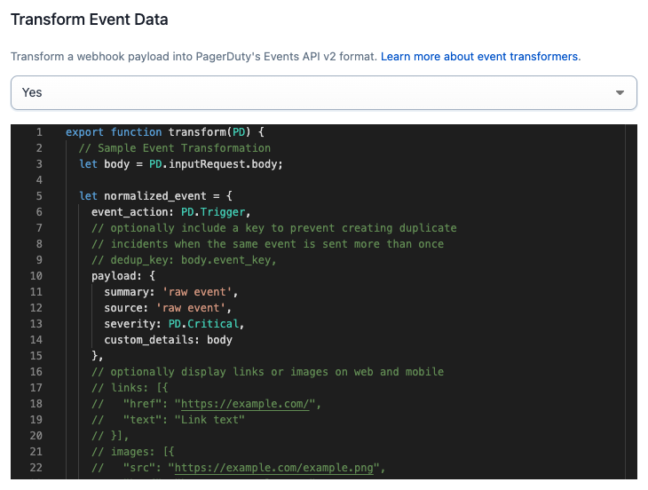
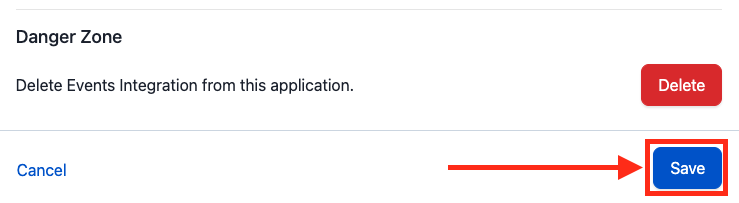
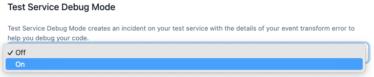

# Writing App Event Transformers

### What is an event transformer?

An event transformer is JavaScript code (ES6) used to convert a payload sent to PagerDuty into the [Events API v2](../../docs/events-API-v2/02-Trigger-Events.md) Common Event Format. Event transformers are hosted and executed in PagerDuty.

Event transformers are part of [Events Integration](../../docs/app-integration-development/06-Events-Integration.md) app functionality.

[Learn more about event transformers and how to add them to your app](../../docs/app-integration-development/06-Events-Integration.dm#add-an-event-transformer)

## Code Editor

The [Events Integration](../../docs/app-integration-development/06-Events-Integration.md)  app functionality page contains a [Monaco](https://github.com/microsoft/monaco-editor) code editor which you can use to author your JavaScript (ES6) transform.

### Saving / Deploying
* You must click the **Save** button at the bottom of the page to save and deploy changes.
* After saving, your transform may take several minutes to deploy. **During this time, events will not be processed.**

### Syntax Errors
* The editor will highlight syntax errors for you to address.
* You will not be able to save and deploy a transformer until syntax errors are addressed.

### Runtime Errors / Debugging Your Transformer
* [Create a test service](../../docs/app-integration-development/06-Events-Integration.dm#test-your-integration), and then enable debug mode to have an incident triggered on your service when a runtime error occurs during development.
* Send test webhooks to the test service endpoint.
* **Note:** enabling debug mode will only alert you of runtime errors on this particular service. You will not be notified when others leverage your app event transformer once it is published.

## The PD Object

The `PD` object is a utility to help you process and transform an event. Its constants and methods are below.

### Constants
#### Event types
For convenience, constants are provided for the `event_type` field: `PD.Trigger`, `PD.Acknowledge`, and `PD.Resolve`.

  Name            | Description
----------------- | -----------
`PD.Trigger`      | use this event type to trigger an incident
`PD.Resolve`      | use this event type to resolve a triggered incident
`PD.Acknowledge`  | use this event type to acknowledge a triggered incident

#### PD.inputRequest

This object allows you to access the request that your integration just sent to PagerDuty.

  Name                     | Description
-------------------------- | -----------
`PD.inputRequest.uri`      | an object with the details of the URI that the request was sent to
`PD.inputRequest.rawBody`  | the raw, unparsed body of the request
`PD.inputRequest.body`     | the parsed body of the request, if a supported `Content-Type` was given. Supported `Content-Type`s are `application/json`, `application/x-www-form-urlencoded` and `multipart/form-data`
`PD.inputRequest.headers`  | the HTTP headers present in the request
`PD.inputRequest.method`   | the HTTP method used to make the request

### Methods
#### PD.assertType
Signature: `PD.assertType(type, value, value_human_name)`

`PD.assertType` is a utility function used to assert the type of a field. If the assertion fails, we will drop the event and the function execution will stop. If the assertion passes, the function execution continues.

Examples:
  * `PD.assertType(Array, x, "the key x in object inputRequest.body")`
  * `PD.assertType([Boolean, Number], x, "the key x in object inputRequest.body")`

#### PD.fail
Signature: `PD.fail(error_message)`

`PD.fail` is used to indicate that the event should be dropped

Example:
* `PD.fail(“Failed to parse event”)`

#### PD.emitEventsV2
Signature: `PD.emitEventsV2([pagerduty_events_v2_object])`

`PD.emitEventsV2` is used to emit an event or multiple events into the PagerDuty ecosystem

### PagerDuty Events v2 Object
The PagerDuty Events v2 object is in the [Events API v2 format](../../docs/events-API-v2/02-Trigger-Events.md).

After applying logic, your transformer should pass a PagerDuty Events v2 object to the `PD.emitEventsV2` method (see section above).
