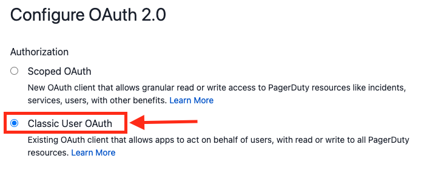
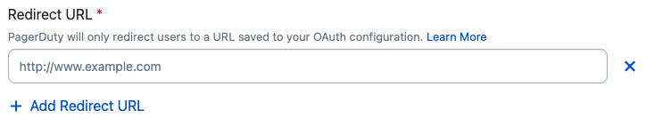

# Classic User OAuth

## What is Classic User OAuth?
Classic User OAuth allows your app to connect to our [REST API](/api-reference/) as a PagerDuty user (not full account access) to administer PagerDuty or get data (create an on-call schedule, get a list of team members, etc).

## Why should I use Classic User OAuth?
With Classic User OAuth, you can present a user with a prompt to log in with their PagerDuty account and authorize your app to access their PagerDuty data.

This is a simple and seamless process for the user and more secure because as an app developer you can:
* Limit your access to read-only
* Scope your access to the permissions of a specific user
* Allow PagerDuty users to monitor and revoke access to your app at any time
* Eliminate copying and pasting API tokens which could lead to the token falling into the wrong hands

## Add Classic User OAuth functionality to your app
1. [Create an app in PagerDuty](../../docs/app-integration-development/03-Register-an-App.md)

2. In the **Functionality** section, click **Add** on the Classic User OAuth card.

3. On the next page, enter a **Redirect URL**. PagerDuty will only redirect users to a URL saved to your OAuth configuration. Click **Save**. You can edit or add redirect URLs later.

4. You will be shown a modal that displays the **Client ID** and the **Client Secret**. The Client Secret will only be displayed once for security purposes, after which you will have to delete the OAuth client and create a new one if the Client Secret is compromised or otherwise lost. The Client Secret should be stored securely and must not be shared publicly -- if you are using OAuth in a frontend application we recommend the PKCE flow instead (see section on Choosing an OAuth Flow below). The Client ID is public and will be used to identify the app when it authenticates with PagerDuty.

5. Under **Set Permission Scopes**, select an option from the drop-down. By default, the app does not have any permissions set. There are two scope options: **Read** or **Read/Write**. These scopes are tied to the user’s permissions. Authenticated users will only be able to read and write to objects that they have access to.

6. It is recommended to **Add a message to users** to let them know what data the app will access and how the app will utilize that data.

Congratulations! Classic User OAuth is successfully configured for the app. Now you can move on to implementing one of the authorization flows below.

## Implementing OAuth / Choosing an OAuth Flow

There two options for implementing PagerDuty OAuth in your app. [PKCE (Proof Key for Code Exchange](../../docs/app-integration-development/10-Classic-User-OAuth-PKCE.md) is recommended and should work for all apps. The [Authorization Code Grant](../../docs/app-integration-development/09-Classic-User-OAuth-Auth-Code-Grant.md) Flow is also supported, but is only recommended for server-side applications where you have control over the entire environment.

| Choose A Flow For Your App   |      Server-side App*      |  Client-side App** |
|:---------------------------------------------------------------------------------------|:-----|:----|
| PKCE - Proof Key for Code Exchange **(Recommended)** |  Yes | Yes |
| Authorization Code Grant |  Yes | No  |

**Client-side App* - an app which runs in the browser or a native mobile app, also known as a public client

**Server-side App* - an app running on a server which can securely store secrets, also known as a confidential client

## Removing Classic User OAuth Functionality

See [Removing Functionality From Your App](../../docs/app-integration-development/04-App-Functionality.md#removing-functionality-from-your-app)
