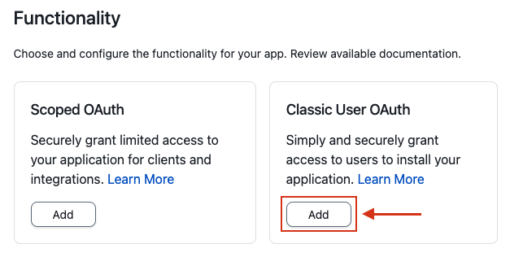
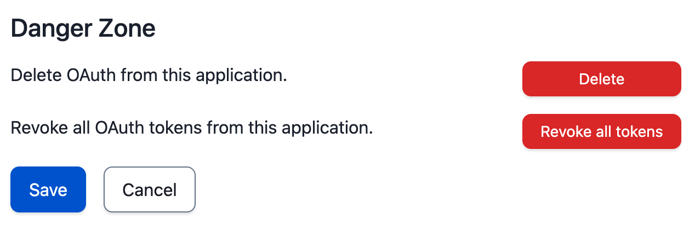

# OAuth Functionality

## What is OAuth functionality?

PagerDuty Apps can use OAuth functionality to obtain access tokens that allow the application to interact with the PagerDuty [REST API](/api-reference/) on behalf of a user or as the app itself.

For example, an application with its own UI may wish to call the PagerDuty REST API _as a user_ to obtain data specific to that user. An application that receives PagerDuty webhooks or performs other server-side processing may wish to call back to the PagerDuty _as the app_ to obtain more information or update state.

The capabilities and behavior differ based on whether you choose to use the Scoped OAuth or Classic User OAuth functionality.

## OAuth or PagerDuty API key?
A PagerDuty App with OAuth functionality is the preferred choice for both third-party integrations and long-lived applications. PagerDuty Apps with OAuth can be used by a single account building private software or developers building integrations used by many accounts.

User API Keys are useful for scripts and personal projects but are also tied to that single user. If the user leaves the account then the key is disabled and the application will no longer function properly. Account API Keys have full access to a PagerDuty account, and are very simple to use, however they don't have security-conscious features such as refresh flows, and are a little bit less user-friendly involving copying and pasting the raw secret value.

## Types of OAuth functionality

### Classic User OAuth

With Classic User OAuth the application is always acting as a PagerDuty User. The application must take the user through an OAuth 2.0 authorization code flow to obtain their authorization and consent before being granted a user OAuth token. See [Obtaining a User OAuth Token](09-User-OAuth-Token.md) for the details of obtaining these tokens.

Classic User OAuth is selected on the **Configure OAuth 2.0** screen when you [add OAuth functionality](04-App-Functionality.md#adding-functionality-to-your-app) to your app:

The access available to an application using Classic User OAuth is the intersection of the scopes granted to the application and the permissions of the user the application is acting on behalf of. Scopes in Classic User OAuth are limited to either `read` which allows read-only access to all resources available to the authorizing user, or `write` which allows read/write access to all resources available to the authorizing user.

PagerDuty Apps with Classic User OAuth can be used with other PagerDuty accounts. Once a Classic User OAuth app has been registered, a user on any account can authorize the app. [Publishing your app](11-Publish-Your-App.md) — having PagerDuty review it and list it for all customers to discover — is available and recommended.

Classic User OAuth is also the only OAuth functionality that supports non-confidential clients, such as a single page app or a native mobile app. See [Confidential vs non-confidential clients and PKCE](#confidential-vs-non-confidential-clients-and-pkce) below.

### Scoped OAuth

Scoped OAuth is the newer of the two OAuth functionalities. An app with Scoped OAuth can obtain an app token, a user token, or both. See [Obtaining an App OAuth Token](12-App-OAuth-Token.md) and [Obtaining a User OAuth Token](09-User-OAuth-Token.md) for the details of each.

Three things distinguish it from Classic User OAuth:

**It is limited to a single account.** A Scoped OAuth app cannot currently be published for use with other PagerDuty accounts — it can only access the account that created it. If you are building an integration for many accounts, use Classic User OAuth.

**Its scopes apply to individual resource types.** Rather than a single `read` or `write` scope covering everything the authorizing user can reach, Scoped OAuth grants access per resource type: `incidents.read` reads incidents and nothing else, while `incidents.write` can create, update, or delete an incident without being able to read existing ones. This lets you grant an app only the access it actually needs.

**It can act as the app itself, not just as a user.** A Scoped OAuth app can obtain an app token through the OAuth 2.0 client credentials flow, with no user involved. This suits server-to-server work — responding to a webhook, running a scheduled job — and removes the need to maintain a service or bot user account just to hold credentials.

The access a token actually has depends on its type:

* With an **app token**, access is limited only by the scopes granted to the app. If the app has the `incidents.read` scope, it can read all incidents on the account.
* With a **user token**, access is the intersection of the app's scopes and the user's permissions. If an app has the `incidents.read` scope and is acting as user Pagey, it can only read incidents that Pagey has permission to see.

If a [REST API](/api-reference/) endpoint works with Scoped OAuth, the documentation for that endpoint will say "Scoped OAuth requires:" and list the required scope to access the endpoint.

## Confidential vs non-confidential clients and PKCE

When an app is registered, it generates and presents a `client_secret`.

* A **confidential client** runs somewhere you control end to end, such as a server-side web app or a backend service, and can securely store the `client_secret`.
* A **non-confidential client** cannot protect the `client_secret` because its code is distributed to users, as with a single page app running in the browser or a native mobile app.

Proof Key for Code Exchange (PKCE) is a standard extension to the OAuth 2.0 framework, and is generally recommended with any authorization code grant.

Classic Apps can be used either confidentially or non-confidentially. PKCE must be used in the flow, if the `token` request will not include the `client_secret`.

Scoped Apps only support confidential clients. The `client_secret` must be included in the `token` request. PKCE is required.

| |Classic User OAuth|Scoped OAuth|
|-|-|-|
|**Confidential client**|Yes. PKCE is optional, and recommended.|Yes. PKCE is required.|
|**Non-confidential client**|Yes. PKCE is required.|No.|

PagerDuty Apps with Scoped OAuth have a `client_id` and `client_secret` that can be used to obtain app tokens without the involvement of a user, so they must have a server-side component where the `client_secret` is properly secured. The `client_secret` should never be stored in the browser or passed in an insecure manner. Scoped OAuth apps must also always use PKCE when obtaining a user token.

Classic User OAuth apps can be built as either kind of client. A non-confidential client omits the `client_secret` when calling the token endpoint, and must use PKCE to do so.

See [Obtaining a User OAuth Token](09-User-OAuth-Token.md) for how to implement the flow in each case.

## Token Lifetimes
The tokens and user authorization involved in PagerDuty OAuth have a finite lifetime. This section describes the expiration of the various tokens for each type of PagerDuty OAuth.

### Classic User OAuth
All Classic User OAuth clients have the following expiry settings:

 - access token expiry of 30 days
 - refresh token expiry of 210 days
 - rolling refresh window of 3 years

This means that if your Classic User OAuth app implements the refresh token flow, your customers will be able to use that app continuously with PagerDuty for three years, as long as there is some kind of activity with PagerDuty at least once every 210 days.

### Scoped OAuth
All Scoped OAuth clients have the following settings:

 - access token expiry of 1 day
 - refresh token expiry of 30 days
 - rolling refresh window of 1 year

Refresh tokens only apply to user tokens. When an app token expires, the application can simply request a new token.

Scoped OAuth applications that implement the refresh token flow for user tokens will allow your customers to use your application continuously for one year, as long as they use it at least once every 30 days.

## Revoking Tokens
In the event you believe your application's OAuth tokens to be compromised, you may choose to revoke all tokens currently issued to the application via the [App Registration](03-Register-an-App.md) UI.

The following options are available on the OAuth functionality Client screen of a PagerDuty App:

The "Revoke All Tokens" operation will invalidate all OAuth tokens for the current application. In the event you believe your application's `client_secret` to be compromised, you may choose to delete OAuth functionality from the application and recreate it.

<!-- theme:info -->
> Deleting the OAuth functionality _does not_ automatically revoke existing tokens. If you wish to perform both operations, you must revoke
> all tokens _before_ deleting the OAuth functionality.
