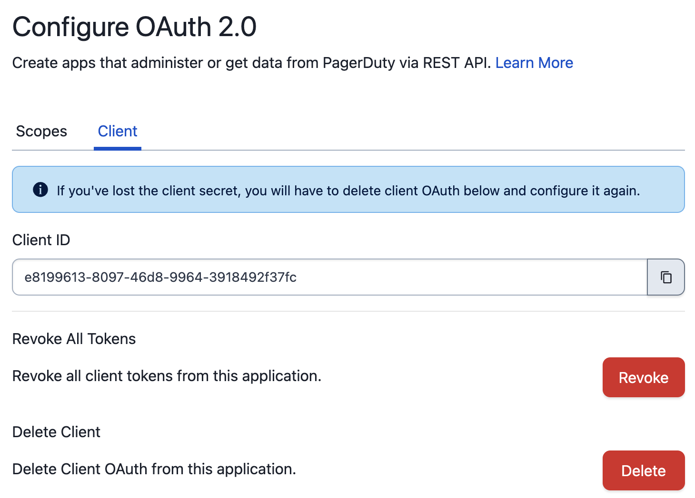

# OAuth Functionality

## What is OAuth functionality?

PagerDuty Apps can use OAuth functionality to obtain access tokens that allow the application to interact with the PagerDuty [REST API](/api-reference/) on behalf of a user or as the app itself.

For example, an application with its own UI may wish to call the PagerDuty REST API _as a user_ to obtain data specific to that user. An application that receives PagerDuty webhooks or performs other server-side processing may wish to call back to the PagerDuty _as the app_ to obtain more information or update state.

The capabilities and behavior differ based on whether you choose to use the Scoped OAuth or Classic User OAuth functionality.

## OAuth or PagerDuty API key?
A PagerDuty App with OAuth functionality is the preferred choice for both third-party integrations and long-lived applications. PagerDuty Apps with OAuth can be used by a single account building private software or developers building integrations used by many accounts.

User API Keys are useful for scripts and personal projects but are also tied to that single user. If the user leaves the account then the key is disabled and the application will no longer function properly. Account API Keys have full access to a PagerDuty account, and are very simple to use, however they don't have security-conscious features such as refresh flows, and are a little bit less user-friendly involving copying and pasting the raw secret value.

## Types of OAuth functionality

### Classic User OAuth

With Classic User OAuth the application is always acting as a PagerDuty User. The application must take the user through an OAuth 2.0 code flow to obtain their authorization and consent before being granted a user OAuth token. See [Obtaining a User OAuth Token via Code Grant](09-User-OAuth-Token-Code-Grant.md) and [Obtaining a User OAuth Token via PKCE](10-User-OAuth-Token-PKCE.md) for the two methods of obtaining these tokens. See below for a discussion of the differences between these two methods.

The access available to an application using Classic User OAuth is the intersection of the scopes granted to the application and the permissions of the user the application is acting on behalf of. Scopes in Classic User OAuth are limited to either `read` which allows read-only access to all resources available to the authorizing user, or `write` which allows read/write access to all resources available to the authorizing user.

PagerDuty Apps with Classic User OAuth can be published for use with other PagerDuty accounts.

### Scoped OAuth

Scoped OAuth allows an application to act as the PagerDuty App itself by obtaining an app token using an OAuth 2.0 client credentials flow. Optionally, it can also act as a user after obtaining their authorization and consent. See [Obtaining an App OAuth Token](12-App-OAuth-Token.md), [Obtaining a User OAuth Token via Code Grant](09-User-OAuth-Token-Code-Grant.md) and [Obtaining a User OAuth Token via PKCE](10-User-OAuth-Token-PKCE.md) for the details of obtaining each type of token.

The access available to an application using Scoped OAuth differs by token type:
* With an app token, access is only limited by the scopes granted to the application. If the application has the `incidents.read` scope, it will be able to read all incidents on the account.
* With a user token, access is the intersection of the scopes granted to the application and the permissions of the user. If an application has the `incidents.read` scope and is acting as user Pagey, it will only be able to read incidents that user Pagey has permission to see.

If a [REST API](/api-reference/) endpoint works with Scoped OAuth, the documentation for that endpoint will say "Scoped OAuth requires:" and list the required scope to access the endpoint.

PagerDuty Apps with Scoped OAuth cannot currently be published to allow use with other PagerDuty accounts. The application is limited to accessing the PagerDuty account that created it.

### Understanding what type of OAuth functionality to use

#### Scoped OAuth offers improved security
Scoped OAuth improves on Classic User OAuth by offering a set of scopes that individually grant access to read or write a single type of resource. For example, the `incidents.read` scope is only able to read incidents on an account. The `incidents.write` scope is able to create, update, or delete an incident but is not able to read existing incidents.

#### Scoped OAuth can act as an app or as a user
Scoped OAuth has the ability to act outside the context of a user as a PagerDuty App. This is useful in server-to-server flows where a user may not be involved. It also eliminates the need to manage service or bot user accounts. When configured with a redirect URI, Scoped OAuth applications can also act as a user after getting the user's authorization and consent.

#### Only Classic User OAuth can be used with other PagerDuty accounts
If you are building an integration on top of PagerDuty with the intention of publishing it for use with many PagerDuty accounts, then Classic User OAuth continues to be the right choice.

#### Scoped OAuth applications must be able to securely store the client secret
PagerDuty Apps with Scoped OAuth have a `client_id` and `client_secret` that can be used to obtain app tokens without the involvement of a user. Applications using Scoped OAuth functionality must have a server-side component where the `client_secret` is properly secured. The `client_secret` should never be stored in the browser or passed in an insecure manner.

#### When to use the PKCE flow for user tokens
For Classic User OAuth, there are two options for obtaining a user OAuth token with your app. [PKCE (Proof Key for Code Exchange)](12-App-OAuth-Token.md) is recommended and should work for all apps. The [authorization code grant](09-User-OAuth-Token-Code-Grant.md) flow is also supported, but is only recommended for server-side applications where you have control over the entire environment.

| Choose A Flow For Your App   |      Server-side App*      |  Client-side App** |
|:---------------------------------------------------------------------------------------|:-----|:----|
| PKCE - Proof Key for Code Exchange **(Recommended)** |  Yes | Yes |
| Authorization Code Grant |  Yes | No  |

**Server-side App* - an app running on a server which can securely store secrets, also known as a confidential client

***Client-side App* - an app which runs in the browser or a native mobile app, also known as a public client

PagerDuty Apps with Scoped OAuth are able to obtain user tokens [via authorization code grant](09-User-OAuth-Token-Code-Grant.md) or [via PKCE](10-User-OAuth-Token-PKCE.md). The PKCE flow is preferred and adds additional security. However, Scoped OAuth should never be used in a public client architecture.

## Token Lifetimes
The tokens and user authorization involved in PagerDuty OAuth have a finite lifetime. This section describes the expiration of the various tokens for each type of PagerDuty OAuth.

### Classic User OAuth
All Classic User OAuth clients registered prior to October 30th 2022 have the following settings:

 - access token expiry of one year
 - refresh token expiry of one year

After October 30th 2022, all newly registered Classic User OAuth clients will have the following settings:

 - access token expiry of 30 days
 - refresh token expiry of 210 days
 - rolling refresh window of 3 years

After April 30th 2023, we will apply the new expiry settings to all Classic User OAuth clients.

Classic User OAuth applications that implement the refresh token flow will allow your customers to use your application continuously for three years, as long as
they use it at least once every 210 days.

### Scoped OAuth
All Scoped OAuth clients have the following settings:

 - access token expiry of 1 day
 - refresh token expiry of 30 days
 - rolling refresh window of 1 year

Refresh tokens only apply to user tokens. When an app token expires, the application can simply request a new token.

Scoped OAuth applications that implement the refresh token flow for user tokens will allow your customers to use your application continuously for one year, as long as they use it at least once every 30 days.

## Revoking Tokens
In the event you believe your application's OAuth tokens to be compromised, you may choose to revoke all tokens currently issued to the application via the [App Registration](03-Register-an-App.md) UI.

The following options are available on the OAuth functionality screen of a PagerDuty App:

The "Revoke all tokens" operation will invalidate all OAuth tokens for the current application. In the event you believe your application's `client_secret` to be compromised, you may choose to delete OAuth functionality from the application and recreate it.

<!-- theme:info -->
> Deleting the OAuth functionality _does not_ automatically revoke existing tokens. If you wish to perform both operations, you must revoke
> all tokens _before_ deleting the OAuth functionality.
