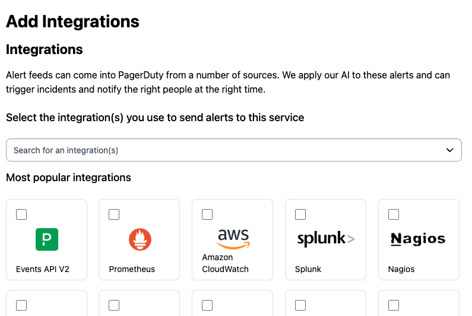
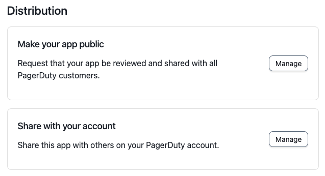
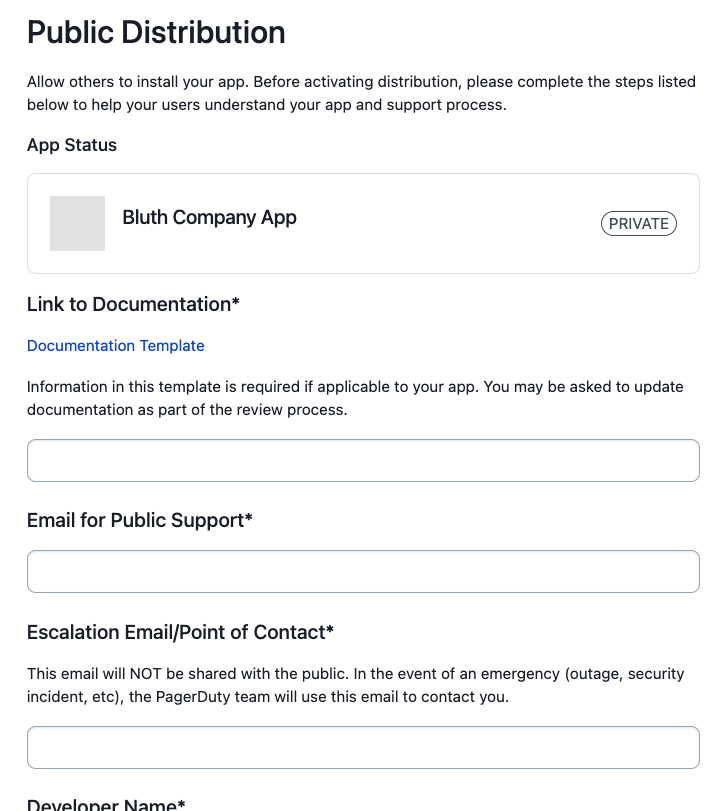
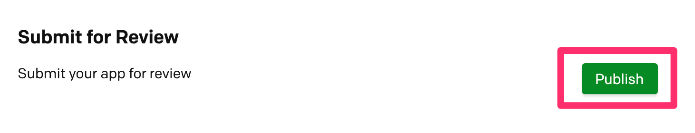

# Publish your App

Once you are done building your app, you can submit it for review to be published.

Publishing is **required** for an app with [Events Integration](05-Events-Integration.md) functionality to work on accounts other than the one that created it. It also enables the [Simple Install Flow](05-Events-Integration.md#simple-install-flow-optional-but-recommended), and adds your app to the **Add Integrations** list in the Service Directory:



Publishing is **required** for an app with [Scoped OAuth](06-OAuth-Functionality.md#scoped-oauth) functionality to work on accounts other than the one that created it. After approval, an admin on each account must also install it — see [Scoped OAuth apps on other accounts](#scoped-oauth-apps-on-other-accounts) below.

Publishing is **recommended** for an app with [Classic User OAuth](06-OAuth-Functionality.md#classic-user-oauth) functionality. Those apps already work across accounts as soon as they are registered, but publishing adds yours to our [integrations library](https://www.pagerduty.com/integrations/).

## Manage Distribution

On your app's configuration page, scroll down to the **App Type** section and select the Public option and click on the Distribution Form button. Before the App can be made public the Distribution Form needs to be completed.



## Publish To All PagerDuty Users

You can optionally publish your app for all PagerDuty users to discover and use. Follow these steps to submit your app for review.

1. On the **Distribution Form** page (see above), enter information for your app listing (like documentation and support contact) and provide instructions for testing your app.



2. At the bottom of the **Distribution Form** page click the **Save** button. Upon returning to the Edit App page, click **Save** and confirm that you want to submit the app for review.



Once you submit, you will no longer be able to make updates to your app. If you need to make changes after you submit, please contact apps@pagerduty.com to get your app back into an editable draft state.

You should receive a confirmation email once your app is submitted for review.

## Review Process

We aim to review your submission and approve or reply with feedback within 5 business days.

**During the review process, we will:**
* Test your app's functionality
* Review documentation for completeness and accuracy (please use this [documentation template](https://github.com/PagerDuty/app-documentation-templates/blob/master/integration-guide-template.md) to avoid change requests during review)
* Ensure all required information is submitted and accurate for your listing (support contact, website links, etc)

If we find issues with your submission or have questions, we will contact you at the email used for your PagerDuty account. The reviewer may ask for additional info or updates to your app or documentation before your submission is approved.

If you have questions about this process or your submission, please email **apps@pagerduty.com**.

## Scoped OAuth apps on other accounts

A [Scoped OAuth](06-OAuth-Functionality.md#scoped-oauth) app works on the account that created it as soon as it is
registered. Until it has been submitted for review and approved, it behaves as a [private app](02-Private-Apps.md):
it only works on the account that created it.

Once published, your app can be used on other accounts to obtain **user tokens**, by taking a user on that account
through the [user token flow](06-OAuth-Functionality.md#obtaining-a-user-oauth-token) to get their authorization and
consent. Its access there is the intersection of the scopes granted to the app and the permissions of the authorizing
user. App tokens are not available on other accounts — the [client credentials flow](02-Private-Apps.md#app-tokens)
only works on the account that created the app.

### Installation by an account admin

Before any user on another account can authorize your app, an admin on that account must install it. Until the app is
installed, authorization requests from users on that account will not succeed.

To have your app installed on an account, give an admin on that account the following installation link, replacing
`[app_id]` with the ID of your app:

```
https://app.pagerduty.com/oauth_apps/[app_id]
```

The admin will be shown your app's name, the scopes it is requesting, and the kinds of token it can obtain. From
here they can install it on their account:


Installing does not by itself grant your app any access. It permits users on that account to authorize your app —
each user still completes the OAuth flow individually. Once the admin has installed it, users on that account can
authorize your app through the [user token flow](06-OAuth-Functionality.md#obtaining-a-user-oauth-token) as normal.

