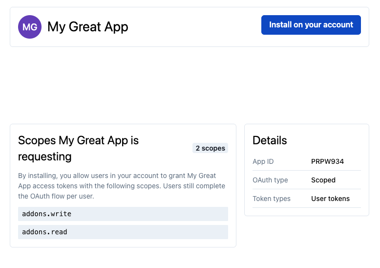

# Public Scoped Apps

<!-- theme: warning -->

> ### Early Access
>
> The features described on this page are in an [Early Access](https://www.pagerduty.com/early-access/) state and are
> subject to change. Please reach out to us if you have any questions or need support.

An app that uses Scoped OAuth is normally a [private app](02-Private-Apps.md): it only works on the account that
created it. Public Scoped Apps extend Scoped OAuth so that a single app can be used across many PagerDuty accounts,
as [Classic User OAuth](06-OAuth-Functionality.md#classic-user-oauth) apps can be today.

## User tokens only

A Public Scoped App can only obtain **user tokens** for other accounts, by taking a user on that account through the
[user token flow](06-OAuth-Functionality.md#obtaining-a-user-oauth-token) to get their authorization and consent.

The [client credentials flow](02-Private-Apps.md#app-tokens), which issues an **app token** with no
user involved, is not available for Public Scoped Apps.

When your app acts as a user, its access is the intersection of the scopes granted to the app and the
permissions of the authorizing user, as described for user tokens under [Scoped OAuth](02-Private-Apps.md#scoped-oauth).

The requirements of the user token flow are unchanged: a Scoped OAuth app is always a
[confidential client](06-OAuth-Functionality.md#confidential-vs-non-confidential-clients-and-pkce), so it must send
its `client_secret` on the token request and must use PKCE.

## Publishing

A Public Scoped App must be [published](08-Publish-Your-App.md) before it can be used by other accounts. Until your
app has been submitted for review and approved, it behaves as a private app: it only works on the account that
created it.

## Installation by an account admin

Before any user on another account can authorize your app, an admin on that account must install it. Until the app is
installed, authorization requests from users on that account will not succeed.

To have your app installed on an account, give an admin on that account the following installation link, replacing
`[app_id]` with the ID of your app:

```
https://app.pagerduty.com/oauth_apps/[app_id]
```

The admin will be shown your app's name, the scopes it is requesting, and the kinds of token it can obtain. From
here they can install it on their account:



Installing does not by itself grant your app any access. It permits users on that account to authorize your app —
each user still completes the OAuth flow individually. Once the admin has installed it,
users on that account can authorize your app through the
[user token flow](06-OAuth-Functionality.md#obtaining-a-user-oauth-token) as normal.
