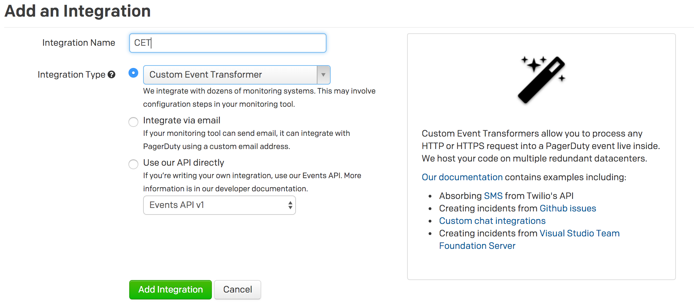

# Custom Event Transformer

<!-- theme:warning -->
> ### Apps are the preferred way to create Event Transformers
> [Create an app to get these new benefits:](../../docs/app-integration-development/06-Events-Integration.md#add-an-event-transformer)
> * Use your Event Transformer on any PagerDuty service on your account
> * Publish your Event Transformer as an integration for all PagerDuty users
> * Syntax highlighting and linting to catch errors
> * More modern JavaScript (ES6)

</Alert>

A Custom Event Transform allows users to reliably convert a payload sent by integrations to a payload understood by PagerDuty, using JavaScript (ES5).

## Writing your first Custom Event Transform



1. Create a new service, or add an integration to an existing service, and for **Integration Type**, select **Custom Event Transformer**.
2. Once you have created the integration or service, go to the view page of the integration.
  * Click **Show JavaScript**.
  * You have some pre-populated code which would create an event with the raw body of the request in the body.
3. Send a test payload via HTTP POST to the integration URL.
4. Once you have sent the test alert, an incident will be triggered. The details in your incident contains the body of the request that was sent, which demonstrates the structure of data available to you within the scope of the JavaScript.
5. Note the option **Debug mode**. This can be disabled once you are done designing your Custom Event Transform to ignore events that are incompatible with your transform, which includes people accidentally opening the integration URL in their web browser.


To understand the pre-populated code and how to get your function to emit events to PagerDuty, see **The PD Object** below.

## The PD Object

### Constants
#### Event types

Use one of these three constants to indicate the type of event in the normalized event.

  * `PD.Trigger` - use this event type to trigger a new event
  * `PD.Resolve` - use this event type to resolve a triggered incident
  * `PD.Acknowledge` - use this event type to acknowledge a triggered incident

#### PD.inputRequest

This object allows you to access the request that your integration just sent to PagerDuty.

  * `PD.inputRequest.uri` - an object with the details of the URI that the request was sent to
  * `PD.inputRequest.rawBody` - the raw, unparsed body of the request
  * `PD.inputRequest.body` - the parsed body of the request, if a supported `Content-Type` was given. Supported `Content-Type`s are `application/json`, `application/x-www-form-urlencoded` and `multipart/form-data`
  * `PD.inputRequest.headers` - the HTTP headers present in the request
  * `PD.inputRequest.method` - the HTTP method used to make the request

### Methods
#### PD.assertType
  * `PD.assertType` is a utility function used to assert the type of a field. If the assertion fails, we will drop the event and the function execution will stop. If the assertion passes, the function execution continues.
  * Signature: `PD.assertType(type, value, value_human_name)`

Examples:
  * `PD.assertType(Array, x, "the key x in object inputRequest.body")`
  * `PD.assertType([Boolean, Number], x, "the key x in object inputRequest.body")`

#### PD.fail
  * `PD.fail` is used to indicate that the event should be dropped
  * Signature: `PD.fail(error_message)`

Example: `PD.fail(“Failed to parse event”)`

#### PD.emitGenericEvents
  * `PD.emitGenericEvents` is used to emit an event or multiple events into the PagerDuty ecosystem
  * Signature: `PD.emitGenericEvents([the_pagerduty_payload])`


### The PagerDuty Payload
The PagerDuty event payload is fairly simple. It is a JSON object in the same form as <Link to="/docs/events-API-v1/trigger-events/">accepted by Events API v1</Link>.

For convenience, constants are provided for the `event_type` field: `PD.Trigger`, `PD.Acknowledge`, and `PD.Resolve`.

<Alert variant="info">
  <Alert.Heading>Debug Mode</Alert.Heading>
  Setting your Custom Event Transform to debug mode allows you to test your universal transform as you write it. If there are any errors in your code, you will still receive a triggered incident with a brief description of the error.<br/><br/>You can set the integration to debug mode by changing the configuration of the integration the service.
</Alert>

## Examples

#### A simple service that passes raw events

Here's the most basic CET possible. It triggers on every request to the integration URL -- even opening it up in a web browser:

```javascript
var normalized_event = {
  event_type: PD.Trigger,
  description: 'Raw event',
  details: PD.inputRequest
};
PD.emitGenericEvents([normalized_event]);
```
#### Turn a Twilio message into a PagerDuty incident

This CET triggers an incident from a Twilio **SMS/MMS** webhook, and even attaches images from MMS messages:

```javascript
var contexts = [{
  "type": "link",
  "href": "tel:" + PD.inputRequest.body.From,
  "text": "call " + PD.inputRequest.body.From
}];

if (PD.inputRequest.body.MediaUrl0) {
  contexts.push({
    "type": "image",
    "src": PD.inputRequest.body.MediaUrl0
  });
}

var normalized_event = {
  incident_key: PD.inputRequest.body.SmsMessageSid,
  event_type: PD.Trigger,
  description: PD.inputRequest.body.From + " " + PD.inputRequest.body.Body,
  contexts: contexts
};

PD.emitGenericEvents([normalized_event]);
```

#### ServerGuard24

Here's a simple CET from one of our customers to handle webhooks from **ServerGuard24**:

```javascript
var webhook = PD.inputRequest;
var event_type = PD.Trigger;
if(webhook.body.check_result == "OK") {event_type = PD.Resolve;}

var normalized_event = {
  event_type: event_type,
  incident_key: webhook.body.server_name,
  description: webhook.body.check_output,
  details: webhook.body
};

PD.emitGenericEvents([normalized_event]);
```

#### Visual Studio Team Foundation Server 2015

Here's a proof of concept that our support team wrote that creates PagerDuty incident from an issue in Visual Studio Team Foundation Server 2015:

```javascript
function transform(PD) {
  var webhook = PD.inputRequest
  var body = webhook.body || JSON.parse(webhook.rawBody);

  var incident_key = (body.message.markdown||")").split(")")[0]; /*hacky, but resource.workItemId isn't populated on create*/
  var description = body.message.text.split("\r\n")[0];
  var url = null;
  if(incident_key.split("(").length==2) {url = incident_key.split("(")[1];}

  var event_type = PD.Trigger;
  try {
  if(body.resource.fields["System.State"].newValue == "Resolved") { event_type = PD.Resolve; }
  } catch (e) {}

  var normalized_event = {
    event_type: event_type,
    incident_key: incident_key,
    description: description,
    details: body.resource.fields,
    client: "View in Team Foundation Server",
    client_url: url
  };
  PD.emitEvent(normalized_event);
}
```

#### Github

This script takes GitHub issue webhooks and turns them into incidents:

```javascript
var webhook = PD.inputRequest.body;

var normalized_event = {
  event_type: PD.Trigger,
  incident_key: webhook.issue.number,
  description: webhook.issue.title,
  details: {
    description: webhook.issue.body
  },
  client: "Github issues",
  client_url: webhook.issue.html_url
};

if(webhook.action=="opened") PD.emitGenericEvents([normalized_event]);
```


Some customers have started rewriting our supported integrations. For instance, here's the start of a CET that will handle **New Relic**'s generic webhooks:

```javascript
var normalized_event = {
  event_type: PD.Trigger,
  incident_key: PD.inputRequest.body.incident_id,
  description: PD.inputRequest.body.policy_name+": "+PD.inputRequest.body.details,
  details: PD.inputRequest.body,
  client: "New Relic",
  client_url: PD.inputRequest.body.incident_url
};

PD.emitGenericEvents([normalized_event]);
```

#### Instagram → Zapier → PagerDuty

This is CET was demoed on one of our [What's New webinars](https://www.pagerduty.com/whats-new/). It takes a **Zapier** webhook triggered from **Instagram** and makes it a PagerDuty incident:

```javascript
var webhook = PD.inputRequest.body;

var normalized_event = {
  event_type: PD.Trigger,
  description: 'Incoming kitten from ' + webhook.user.username,
  client: 'Instagram',
  client_url: webhook.link,
  contexts: [{
    type: 'image',
    src: webhook.images.standard_resolution.url,
    href: webhook.link,
    alt: webhook.caption.text
  }]
};

if (webhook.caption.text.indexOf('cute') > -1) {
normalized_event.contexts.push({
    type: 'link',
    href: 'https://broadly.vice.com/en_us/article/why-you-are-addicted-to-cute-baby-animals',
    text: '[Runbook] How to handle cuteness overload'
  });
}

PD.emitGenericEvents([normalized_event]);
```

