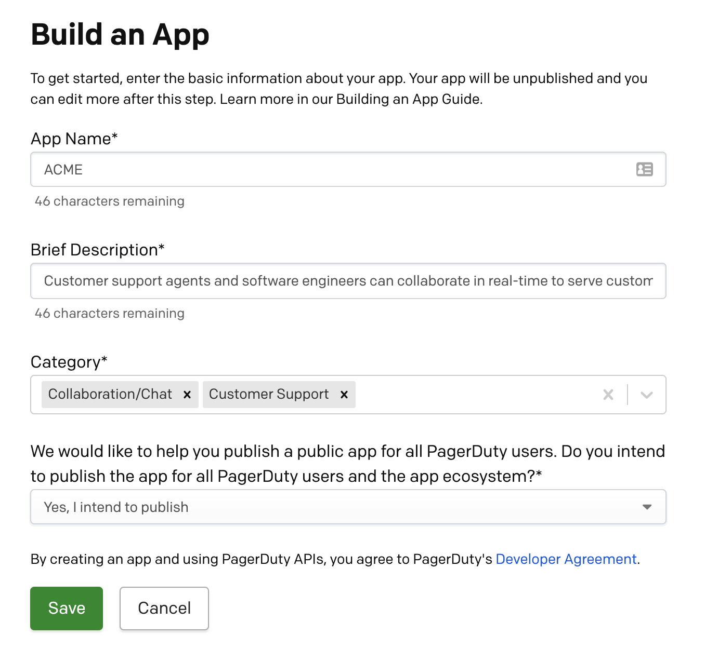

import Alert from 'react-bootstrap/Alert'

### Accessing Developer Mode

When you log into a developer account, you'll be taken straight to Developer Mode. If you're on a PagerDuty customer account, follow these steps:

**Note:** Developer Mode is available only to users with a base role of User or Manager (Advanced Permissions) and above.

1. Log in to your PagerDuty account.
2. From the top menu, select the  icon to the left of the profile picture.
3. Select **Developer Mode** from the menu to navigate to the **My Apps** page.

### Creating an app
<Alert variant="info">
  Apps are associated with a PagerDuty subdomain and a user and cannot be moved between subdomains or users. Continued access to this subdomain and user is needed to make any configuration changes to the app.
</Alert>

1. On the **My Apps** page in **Developer Mode**, select **Create New App**.
2. Enter the **App Name** and **Brief Description**. Then select up to 3 categories from the **Category** selection menu. All of this information can be changed later.
3. Select whether or not you intend to publish your app for all PagerDuty users. This is optional, for information purposes only, and you can change your answer later.
4. Click **Save**.

### Editing your app configuration

Once you've registered an app, it will appear on your **My Apps** page in Developer Mode. Select an app to be taken to it's configuration page where you can edit any of the details you have already entered and add more:

* *Optional*: provide an **App Website URL** where users can learn more about the app.
* *Optional*: upload an **App Icon**, an image file that will display with the app. Icons should be sized 50px by 50px. Once the image file is input, the image will display to the side and in the **Preview** box.

Changes to your app will not be saved until you click **Save** at the bottom of the page. You should get a confirmation that your app was saved.

#### Congratulations!

You have successfully registered your app.

Next, learn how you can <Link to="/docs/app-integration-development/app-functionality/">add functionality to your app</Link> to send and receive data.
