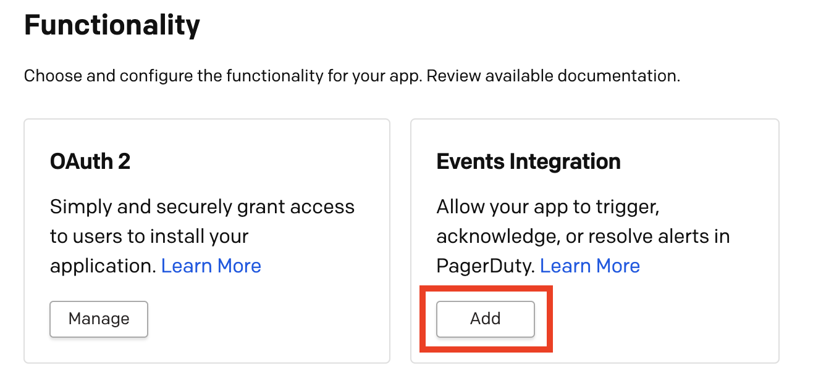
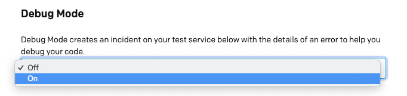

#### What is Events Integration functionality?
Events Integration allows you to send machine events **from** your tool **to** PagerDuty over our asynchronous <Link to="/docs/app-integration-development/events-api-v2/">Events API v2</Link>

#### Why should I use Events Integration?
This is the best way for monitoring tools to connect with PagerDuty in order to trigger incidents. You'll also be able to acknowledge and resolve incidents. Using the Events API means your app will work with PagerDuty's [Event Intelligence](https://www.pagerduty.com/platform/event-intelligence-and-automation/) features like intelligent grouping and triage.

### Add Events Integration to your app

1. First <Link to="/docs/app-integration-development/register-an-app/">create an app in PagerDuty</Link>

2. In the **Functionality** section, click **Add** next to Events Integration. Then click **Save** on the Events Integration config page.



### Simple Install Flow (optional, but recommended)

The Simple Install Flow provides an interface for installing a PagerDuty integration directly from your application. Similar to OAuth!

**Why should I use this flow?**
* Better experience for users. They don't need to copy and paste keys from PagerDuty.
* Less work for you (interface is built and maintained by PagerDuty)

**See it in action here:** [acme.pagerduty.dev](https://acme.pagerduty.dev)

Follow these steps to leverage the simple install flow in your app:

3. Add a redirect URL for your application. This is where we will redirect the browser to once the user completes the install flow. You can optionally include additional query parameters which will be passed through and returned on redirect.


4. Implement a page in your app which will receive the request. You should be prepared to handle a request in this format. Note: you will receive a collection of integration keys and should be prepared to handle more than one.

```http
GET http://<your app URL>?config=<encoded JSON>
```

|||
|-|-|
|`integration_key`|For use the with PagerDuty Events API|
|`name`           |Name of the object the integration key connects to|
|`id`             |Unique ID of the object the integration key connects to|
|`type`           |Type of object (service, global_event_rules, team_rules) Note: others may be added in the future|

**Decoded JSON will follow this format:**

```json{numberLines: true}
{
  "integration_keys": [
    {
      "integration_key": "key1",
      "name": "Super Cool Service",
      "id": "PD12345",
      "type": "service"
    },
    {
      "integration_key": "key2",
      "name": "Global Event Rules",
      "id": "PD6789A",
      "type": "global_rule_set"
    },
    {
      "integration_key": "key3",
      "name": "B Team's Rules",
      "id": "PDBCDEF",
      "type": "team_rule_set"
    }
  ],
  "account": {
    "subdomain": "dev-acme",
    "Name": "Acme Monitoring"
  }
}
```

6. Once you’ve saved, test out your flow using the **Integration Setup URL** on the page.


7. Present this link to users in your application at the right time.

### Add An Event Transformer

**What is an Event Transformer?**

An Event Transformer is an optional part of a PagerDuty app. It contains JavaScript code used to convert a payload sent to PagerDuty into the <Link to="/docs/events-api-v2/trigger-events/">Events API v2</Link> Common Event Format. Event Transformers are hosted and executed in PagerDuty.

**Why should I use an Event Transformer?**

Use an Event Transformer when a technical service you are connecting to PagerDuty is not capable of modifying it's webhooks before they are sent to PagerDuty. An Event Transformer will allow you to connect it to PagerDuty without hosting an application or serverless function to transform the webhook payload.

#### Set up an Event Transformer

1. Under **Transform Event Data** on the Events Integration functionality page, select Yes.


2. If you haven't yet, create a test service (see <Link to="/docs/app-integration-development/events-integration/#test-your-integration">Test your integration</Link> below)

3. Turn on **Debug Mode** just below the code editor to trigger an incident on your test service when a runtime error occurs during your testing. This allows you to debug your transformer code.



4. Click **Save** at the bottom of the page to deploy the default transform.


5. On the Apps Configuration page. scroll down to **Events Integration** and click **Manage** to revisit the Events Transformer editor.

6. To test your Event Transformer, send a test webhook payload via HTTP POST to the **Events API Endpoint** shown in the **Events Integration Test** section of the page


7. Event Transformers support JavaScript (ES6). Use the editor to modify the template to transform any webhook payload into the <Link to="/docs/events-api-v2/trigger-events/">Events API v2</Link> format. <br/><Link to="/docs/app-integration-development/app-event-transforms/">View the detailed guide for writing an app Event Transformer.</Link>

**Note:**
* The pre-populated template creates an event with the raw body of the POST request payload in custom details.
* You must **Save** to redeploy your transformer code.
* After saving, your transform may take several minutes to deploy. **During this time, events will not be processed.**


### Test your integration

Before submitting, make sure your integration is able to trigger, acknowledge, or resolve events in PagerDuty as you expect.

1. Create a test service on the Events Integration page. When you click Create, a schedule and escalation policy will also be created and added to the service.


2. Send test events to the integration key for your test service


3. Click **View** to go to the service page and view incidents or check your notifications to see if they look as you expect.
