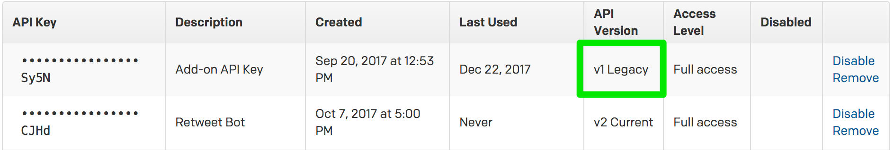

[block:callout]
{
  "type": "danger",
  "body": "On October 19, 2018, REST API v1 was fully decommissioned and is no longer operational.",
  "title": "REST API v1 Now Fully Decommissioned"
}
[/block]
In July 2016, PagerDuty released REST API v2 and announced plans to decommission the REST API v1. This is separate from our Events API which will not be affected. [Learn more about the differences between our APIs here](doc:getting-started).

#### What happened?

On April 24, 2018, REST API v1 entered a decommissioning period. On October 19, 2018, REST API v1 was fully decommissioned and is no longer operational.

PagerDuty users are no longer able generate new REST API v1 keys. No new PagerDuty features will be available for REST API v1.

#### Will existing REST API v1 keys continue to work with v2?

Only if you specify version 2 in the header of your request like so:

```
Accept: application/vnd.pagerduty+json;version=2
```

Without this `Accept` header, REST API v1 keys will not work with REST API v2.

#### Will Events API v1 still be supported?

This change only affects REST API v1. You can continue to use Events API v1 as you do today.[Learn more about our the differences between our APIs here](doc:getting-started).

#### I'm using REST API v1 with a PagerDuty integration. How do I upgrade?

Most of these integrations have been updated to use REST API v2. [Check the "Steps To Upgrade" column on this integration list](doc:v1-rest-api-integrations-update) to see what steps are needed (if any) to upgrade. For those that are not yet upgraded, please use the contact in the last column to check on the status.

[v1 REST API Integrations Update Status Page](doc:v1-rest-api-integrations-update)

#### Why should I upgrade to REST API v2?

REST API v2 provides new endpoints, event normalization, and is easier to use with streamlined API calls, consistent naming, interactive documentation, and much more. [Learn more about v2 by visiting our FAQs page.](doc:api-v2-frequently-asked-questions)

#### Can I use a REST API v1 key with v2?

Yes, you can continue to use existing keys if you specify the API version you'd like to use in the `Accept` header:

```
Accept: application/vnd.pagerduty+json;version=2
```

[Read our Migration Guide for more information](doc:migrating-to-api-v2)

#### How do I know which of my REST API keys default to v1?

Each REST API key has a default version which is used if you do not specify your version in the request header. See [Versioning](doc:versioning) for details on how this works.

### Account Level API Keys

Account owners or admins can see the full list of REST API keys on an account by navigating to **Configuration &rarr; API Access**. The **API Version** column specifies which REST API version the API key uses *by default*. Look for keys with "v1 Legacy" in the API Version column.



### User Level API Keys

Your account may have user level API keys enabled. You can check this by navigating to your User Settings. Click your avatar in the top right corner of your PagerDuty account and select **My Profile**. Once on your profile page, select the **User Settings** tab. If you see an API Access section on this tab, user level API keys are enabled on your account. You should see a similar table where you can check the default version of each key you have created. Each user on your account can manage their user level API tokens on this page.

Only REST API keys are displayed on the **API Access** page. Events API keys are integration keys and can be found on the **Integrations** tab of each individual service. The Events API will not be impacted by the decommissioning of REST API v1.

#### Where can I go for support?

If you haven’t migrated to REST API v2 yet, we encourage you to get started with the [migration guide](doc:migrating-to-api-v2) that walks you through the process. Please reach out to the [community](https://community.pagerduty.com/c/dev?utm_source=web&utm_campaign=dev_rest_v1_faq&utm_medium=link) or contact our support team at support@pagerduty.com if you have questions or encounter problems.

#### Special Note To ServiceNow Customers

When REST API v1 is decommissioned on October 19, 2018, version 3.2.1 of the ServiceNow integration will no longer be operational. If you are using this version, you should plan for an upgrade of your ServiceNow integration. [More information can be found here](https://community.pagerduty.com/t/whats-new-pagerduty-v4-integration-for-servicenow/1019?utm_source=web&utm_campaign=dev_rest_v1_faq&utm_medium=link).
